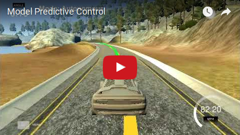

# **MPC - Model-Predictive-Control** 

**Build a MPC-Controller to control a race car simulation**

[//]: # (Image References)

[image1]: ./media/state_visualization.png "State"
[image2]: ./media/kinematic_model_state_transition_functions.png "Kinematic Model"
[image3]: ./media/cte_epsi.png "Errors"
[image4]: ./media/trajectory_polyfit.png "Polyfit"
[image5]: ./media/optimize.png "Trajectories"

## The State Variables
The vehicle state is described by 4 values.  
  * px: x-coordinate of vehicle location in global COS  
  * py: y-coordinate of vehicle location in global COS  
  * psi: orientation / heading of vehicle  
  * vi: velocity of vehicle  
    
![State Visualization][image1]

## Future States
From any given state it is possible to predict any future states - the trajectory. The quality of the forecast depends on the quality of the model. The farther you look into the future using the motion model of the vehicle the more all the non accounted influencing factors accumulate to a deviation from the real world. The Kinematic Model used in this project is simple and does not account for:  
  * slick roads
  * uneven ground
  * wind
  * tire behavior
  * ...

## Kinematic Model
To calculate future states the Kinematic Model uses this state transition functions:
![Kinematic Model][image2]

## Actuations
Actuations like steering, accelerating and braking change the trajectory (predicted future states).
The actuations in the project are:  
  * delta: steering
  * a: accelerating and braking (negative acceleration)

## Cross-Track- And Orientation-Error
The deviation of the actual vehicle state and the desired state is described by 2 values:  
  * cte: the cross track error is the difference between the desired and actual position.
  * epsi: the orientation error is the difference between the desired and actual orientation.
![Errors][image3]

## Trajectory Parameter
To calculate a trajectory, the amount of future steps and their time distance has to be defined.
Many steps would need more calculation effort and my experiments showed that the calculated trajectory that is returned from the optimizer, when I use a lot of steps, does not improve the quality of the path.  
A low number of steps reduces the length and the prediction quality for the further away sections of the path.  
A bigger timestep reduses the resolution. The vehicle executes only the optimized actuations of the next waypoint. If the distance to this next waypoint is to big, the qualtity of the reaction is reduced.  
In this project I choose 14 future steps with a timestep of 0.15 seconds. This setting provides enough trajectory points to find an very good path towards the refence line that is considered the optimal line for the vehicle.  

## Preprocessing MPC
The line that is considered to be the optimal driving line is in the middle of the lane. The simulator delivers the next 6 point of this reference line in global coordinate system.

These calculations are performed prior to the MPC:  
  * The reference points are transformed in the vehicle coordinate system where the x-axis is in the heading direction and the y-axis is 90 degrees to the left of the heading.
  * A 3rd-degree-polynomial is fitted to the refence line using the polyfit-function.
  * The CTE and EPSI is calculated for later use in the cost function of the optimizer.
  * To account for the system latency, the state that is signaled from the simulator is predicted into the future, where dt = latency, by using the actual actuator values.
The MPC is called with the poyfit-coefficients, the modified state (latency) and the errors (cte, epsi).
![Polyfit][image4]

## MPC - Model-Predictive-Control
The MPC varies all possible actuations in all future steps and calculates the resulting trajectories. These possible trajectories are assessed by using the cost function. The trajectory with the lowest cost is considered an optimal trajectory. To follow that trajectory the used actuation values for the next timestep are send to the vehicle in the simulator.
![Trajectories][image5]

## Cost Function
When assessing the trajectories these parameters are used:
  a: Cross-Track-Error CTE: to incentivate a movement towards the reference line
  b: orientation error EPSI: to steer towards the optimal orientation
  c: velocity difference: to accelerate/brake if vehicle != desired velocity
  d: use of steering: to improve the driving experience
  e: use of accelerator/brake: to improve the driving experience
  f: change of steering: to penalize abrupt use of steering
  g: change of accelerator/brake: to penalize abrupt use of steering

This results in this cost function (a' = a in t+1, delta' = delta in t+1):  
cost =  
        a * cte^2 +  
        b * epsi^2 +  
        c * (v - vmax)^2 +  
        d * delta^2 +  
        e * a^2 +  
        f * (a' - a)^2 +  
        g * (delta' - delta)^2  
  
To incentivate an optimal (in my opinion) driving behavior, I choose these weights:  
  a = 2000  
  b = 1500  
  c = 1  
  d = 100  
  e = 10  
  f = 10  
  g = 10  

## Result of Project - Video With Simulator
This is how it looks like when the simulator drives the car around the track with the reference line in yellow and the optimal trajectory in green.

[](https://youtu.be/eHXuPnFPqUM "Model Predictive Control")

---

# Original README of Udacity CarND-Controls-MPC-Project
Self-Driving Car Engineer Nanodegree Program

---

## Dependencies

* cmake >= 3.5
 * All OSes: [click here for installation instructions](https://cmake.org/install/)
* make >= 4.1
  * Linux: make is installed by default on most Linux distros
  * Mac: [install Xcode command line tools to get make](https://developer.apple.com/xcode/features/)
  * Windows: [Click here for installation instructions](http://gnuwin32.sourceforge.net/packages/make.htm)
* gcc/g++ >= 5.4
  * Linux: gcc / g++ is installed by default on most Linux distros
  * Mac: same deal as make - [install Xcode command line tools]((https://developer.apple.com/xcode/features/)
  * Windows: recommend using [MinGW](http://www.mingw.org/)
* [uWebSockets](https://github.com/uWebSockets/uWebSockets)
  * Run either `install-mac.sh` or `install-ubuntu.sh`.
  * If you install from source, checkout to commit `e94b6e1`, i.e.
    ```
    git clone https://github.com/uWebSockets/uWebSockets 
    cd uWebSockets
    git checkout e94b6e1
    ```
    Some function signatures have changed in v0.14.x. See [this PR](https://github.com/udacity/CarND-MPC-Project/pull/3) for more details.
* Fortran Compiler
  * Mac: `brew install gcc` (might not be required)
  * Linux: `sudo apt-get install gfortran`. Additionall you have also have to install gcc and g++, `sudo apt-get install gcc g++`. Look in [this Dockerfile](https://github.com/udacity/CarND-MPC-Quizzes/blob/master/Dockerfile) for more info.
* [Ipopt](https://projects.coin-or.org/Ipopt)
  * Mac: `brew install ipopt`
       +  Some Mac users have experienced the following error:
       ```
       Listening to port 4567
       Connected!!!
       mpc(4561,0x7ffff1eed3c0) malloc: *** error for object 0x7f911e007600: incorrect checksum for freed object
       - object was probably modified after being freed.
       *** set a breakpoint in malloc_error_break to debug
       ```
       This error has been resolved by updrading ipopt with
       ```brew upgrade ipopt --with-openblas```
       per this [forum post](https://discussions.udacity.com/t/incorrect-checksum-for-freed-object/313433/19).
  * Linux
    * You will need a version of Ipopt 3.12.1 or higher. The version available through `apt-get` is 3.11.x. If you can get that version to work great but if not there's a script `install_ipopt.sh` that will install Ipopt. You just need to download the source from the Ipopt [releases page](https://www.coin-or.org/download/source/Ipopt/).
    * Then call `install_ipopt.sh` with the source directory as the first argument, ex: `sudo bash install_ipopt.sh Ipopt-3.12.1`. 
  * Windows: TODO. If you can use the Linux subsystem and follow the Linux instructions.
* [CppAD](https://www.coin-or.org/CppAD/)
  * Mac: `brew install cppad`
  * Linux `sudo apt-get install cppad` or equivalent.
  * Windows: TODO. If you can use the Linux subsystem and follow the Linux instructions.
* [Eigen](http://eigen.tuxfamily.org/index.php?title=Main_Page). This is already part of the repo so you shouldn't have to worry about it.
* Simulator. You can download these from the [releases tab](https://github.com/udacity/self-driving-car-sim/releases).
* Not a dependency but read the [DATA.md](./DATA.md) for a description of the data sent back from the simulator.


## Basic Build Instructions


1. Clone this repo.
2. Make a build directory: `mkdir build && cd build`
3. Compile: `cmake .. && make`
4. Run it: `./mpc`.

## Tips

1. It's recommended to test the MPC on basic examples to see if your implementation behaves as desired. One possible example
is the vehicle starting offset of a straight line (reference). If the MPC implementation is correct, after some number of timesteps
(not too many) it should find and track the reference line.
2. The `lake_track_waypoints.csv` file has the waypoints of the lake track. You could use this to fit polynomials and points and see of how well your model tracks curve. NOTE: This file might be not completely in sync with the simulator so your solution should NOT depend on it.
3. For visualization this C++ [matplotlib wrapper](https://github.com/lava/matplotlib-cpp) could be helpful.

## Editor Settings

We've purposefully kept editor configuration files out of this repo in order to
keep it as simple and environment agnostic as possible. However, we recommend
using the following settings:

* indent using spaces
* set tab width to 2 spaces (keeps the matrices in source code aligned)

## Code Style

Please (do your best to) stick to [Google's C++ style guide](https://google.github.io/styleguide/cppguide.html).

## Project Instructions and Rubric

Note: regardless of the changes you make, your project must be buildable using
cmake and make!

More information is only accessible by people who are already enrolled in Term 2
of CarND. If you are enrolled, see [the project page](https://classroom.udacity.com/nanodegrees/nd013/parts/40f38239-66b6-46ec-ae68-03afd8a601c8/modules/f1820894-8322-4bb3-81aa-b26b3c6dcbaf/lessons/b1ff3be0-c904-438e-aad3-2b5379f0e0c3/concepts/1a2255a0-e23c-44cf-8d41-39b8a3c8264a)
for instructions and the project rubric.

## Hints!

* You don't have to follow this directory structure, but if you do, your work
  will span all of the .cpp files here. Keep an eye out for TODOs.

## Call for IDE Profiles Pull Requests

Help your fellow students!

We decided to create Makefiles with cmake to keep this project as platform
agnostic as possible. Similarly, we omitted IDE profiles in order to we ensure
that students don't feel pressured to use one IDE or another.

However! I'd love to help people get up and running with their IDEs of choice.
If you've created a profile for an IDE that you think other students would
appreciate, we'd love to have you add the requisite profile files and
instructions to ide_profiles/. For example if you wanted to add a VS Code
profile, you'd add:

* /ide_profiles/vscode/.vscode
* /ide_profiles/vscode/README.md

The README should explain what the profile does, how to take advantage of it,
and how to install it.

Frankly, I've never been involved in a project with multiple IDE profiles
before. I believe the best way to handle this would be to keep them out of the
repo root to avoid clutter. My expectation is that most profiles will include
instructions to copy files to a new location to get picked up by the IDE, but
that's just a guess.

One last note here: regardless of the IDE used, every submitted project must
still be compilable with cmake and make./
